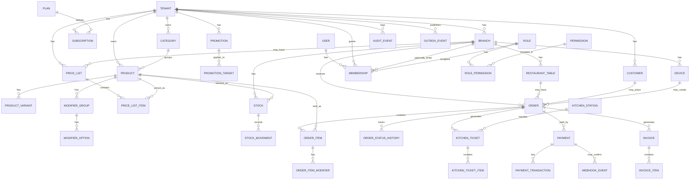

# Totem SaaS - Modelo Conceptual de Datos

## Objetivo del documento

Este documento define un modelo conceptual de datos para el sistema SaaS de totem / menu digital / pedidos para restaurantes y comercios.

Aunque el despliegue inicial use DynamoDB con single-table design, este documento funciona como DER conceptual para entender entidades, relaciones, ownership de dominios y futuras separaciones en lambdas o microservicios.

## Principios de modelado

- El `Tenant` representa el negocio cliente del SaaS.
- La `Branch` representa una sucursal dentro de un tenant.
- El `User` no pertenece directamente a un tenant: se asocia por `Membership`.
- La `Subscription` no debe estar embebida como entidad principal dentro de `Tenant`; debe ser una entidad propia.
- El `Stock` representa el saldo actual, y `StockMovement` representa el historial de movimientos.
- Los estados no deberían modelarse como una tabla genérica `Status`; conviene usar enums por dominio.
- `Order` debe tener cabecera y detalle separado mediante `OrderItem`.
- `OrderItem` debe guardar snapshots de nombre y precio para preservar el histórico.
- Los eventos importantes deberían publicarse mediante `OutboxEvent` si se usa arquitectura event-driven.
- Los pagos con tarjeta no deben procesarse directamente en el backend propio; se deben delegar a un proveedor de pagos.

---

# Entidades maestras / configuración

## Tenant

Representa al cliente que contrata el SaaS.

**Campos sugeridos:**

- id
- legalName
- displayName
- taxId
- taxType
- email
- phone
- address
- status
- ownerUserId
- currentSubscriptionStatus
- currentPlanId
- createdAt
- updatedAt

**Notas:**

`Tenant` puede tener un resumen de suscripción para acceso rápido, pero la entidad real debe ser `Subscription`.

---

## Plan

Representa un plan comercial del SaaS.

**Campos sugeridos:**

- id
- name
- price
- currency
- billingPeriod
- maxBranches
- maxProducts
- maxDevices
- features
- status

**Ejemplos:**

- BASIC
- PRO
- ENTERPRISE

---

## Subscription

Representa la suscripción activa, cancelada, vencida o en trial de un tenant.

**Campos sugeridos:**

- id
- tenantId
- branchId nullable
- planId
- status
- billingScope
- provider
- providerCustomerId
- providerSubscriptionId
- currentPeriodStart
- currentPeriodEnd
- cancelAtPeriodEnd
- createdAt
- updatedAt

**Regla:**

La suscripción pertenece al `Tenant`, pero opcionalmente puede aplicar a una `Branch`.

**billingScope:**

- TENANT: el tenant paga por todo el negocio.
- BRANCH: el tenant paga por cada sucursal.

---

## Branch

Representa una sucursal de un tenant.

**Campos sugeridos:**

- id
- tenantId
- number
- name
- address
- phone
- openingHours
- status
- createdAt
- updatedAt

---

## RestaurantTable

Representa una mesa física de una sucursal.

**Campos sugeridos:**

- id
- tenantId
- branchId
- number
- label
- capacity
- qrCodeId
- status
- createdAt
- updatedAt

---

## Device

Representa un dispositivo operativo: totem, pantalla de cocina, caja o tablet.

**Campos sugeridos:**

- id
- tenantId
- branchId
- type
- name
- status
- activationCode
- lastSeenAt
- metadata
- createdAt
- updatedAt

**Tipos sugeridos:**

- KIOSK
- KITCHEN_SCREEN
- CASHIER_TERMINAL
- TABLET

---

## Category

Agrupa productos dentro del menu o catalogo.

**Campos sugeridos:**

- id
- tenantId
- name
- description
- displayOrder
- status

**Ejemplos:**

- Burgers
- Drinks
- Desserts
- Combos

---

## Product

Representa un producto vendible del tenant.

**Campos sugeridos:**

- id
- tenantId
- sku
- name
- brand
- model
- description
- ingredients
- allergens
- imageUrl
- categoryId
- status
- createdAt
- updatedAt

**Notas:**

El producto debería ser global al tenant. La disponibilidad, stock y precio pueden variar por branch.

---

## ProductVariant

Representa variantes de un producto.

**Campos sugeridos:**

- id
- tenantId
- productId
- name
- sku
- attributes
- status

**Ejemplos:**

- Pizza pequena
- Pizza mediana
- Pizza grande
- Acai 300ml
- Acai 500ml

**Fase recomendada:** fase 2.

---

## ModifierGroup

Representa un grupo de modificadores o extras aplicables a un producto.

**Campos sugeridos:**

- id
- tenantId
- productId
- name
- minSelections
- maxSelections
- required
- status

**Ejemplos:**

- Punto de carne
- Extras
- Salsas

---

## ModifierOption

Representa una opcion dentro de un grupo de modificadores.

**Campos sugeridos:**

- id
- tenantId
- modifierGroupId
- name
- extraPrice
- status

---

## PriceList

Representa una lista de precios.

**Campos sugeridos:**

- id
- tenantId
- branchId nullable
- name
- version
- currency
- validFrom
- validTo
- status
- createdAt
- updatedAt

**Regla:**

- `branchId = null`: lista global del tenant.
- `branchId = b001`: lista especifica de una sucursal.

---

## PriceListItem

Representa el precio de un producto dentro de una lista.

**Campos sugeridos:**

- id
- tenantId
- priceListId
- productId
- productVariantId nullable
- price
- promotionalPrice nullable
- status
- createdAt
- updatedAt

---

## Promotion

Representa una promocion comercial.

**Campos sugeridos:**

- id
- tenantId
- branchId nullable
- name
- type
- policy
- validFrom
- validTo
- status
- createdAt
- updatedAt

**Tipos sugeridos:**

- PERCENTAGE_DISCOUNT
- FIXED_AMOUNT_DISCOUNT
- BUY_X_GET_Y
- FREE_ITEM
- CASHBACK
- POINTS
- COMBO_PRICE

**Ejemplo de policy:**

```json
{
  "percentage": 10
}
```

```json
{
  "buyQuantity": 2,
  "payQuantity": 1
}
```

---

## PromotionTarget

Define a que aplica una promocion.

**Campos sugeridos:**

- id
- tenantId
- promotionId
- targetType
- targetId

**targetType sugeridos:**

- PRODUCT
- CATEGORY
- PRICE_LIST
- BRANCH
- COMBO

---

## User

Representa una persona que puede acceder al sistema.

**Campos sugeridos:**

- id
- email
- name
- phone
- status
- createdAt
- updatedAt

**Regla:**

`User` no debe tener tenant fijo. La relacion con tenants y branches se maneja mediante `Membership`.

---

## Membership

Relaciona usuarios con tenants, branches y roles.

**Campos sugeridos:**

- id
- userId
- tenantId
- branchId nullable
- roleId
- status
- createdAt
- updatedAt

**Ejemplos:**

- Usuario A es OWNER del tenant r001.
- Usuario B es KITCHEN_OPERATOR de la branch b001.
- Usuario C es CASHIER de la branch b002.

---

## Role

Representa un rol funcional.

**Campos sugeridos:**

- id
- tenantId nullable
- name
- description
- roleType
- createdAt
- updatedAt

**Roles sugeridos:**

- SAAS_ADMIN
- TENANT_OWNER
- BRANCH_MANAGER
- CASHIER
- KITCHEN_OPERATOR
- WAITER

---

## Permission

Representa un permiso granular.

**Campos sugeridos:**

- id
- code
- name
- description

**Ejemplos:**

- PRODUCT_CREATE
- PRODUCT_UPDATE
- ORDER_CREATE
- ORDER_CANCEL
- PAYMENT_REFUND
- KITCHEN_TICKET_UPDATE
- USER_INVITE

---

## RolePermission

Relaciona roles con permisos.

**Campos sugeridos:**

- roleId
- permissionId

---

## Customer

Representa al cliente final. Puede ser anonimo para MVP.

**Campos sugeridos:**

- id
- tenantId
- name
- email
- phone
- document
- createdAt
- updatedAt

---

## KitchenStation

Representa una estacion de trabajo de cocina o preparacion.

**Campos sugeridos:**

- id
- tenantId
- branchId
- name
- type
- status

**Ejemplos:**

- Grill
- Bar
- Pizza
- Desserts

---

# Entidades operacionales / transaccionales

## Stock

Representa el saldo actual de stock por producto y sucursal.

**Campos sugeridos:**

- id
- tenantId
- branchId
- productId
- availableQuantity
- reservedQuantity
- minimumQuantity
- updatedAt

**Regla:**

`Stock` es el estado actual. El historial debe ir en `StockMovement`.

---

## StockMovement

Representa el libro de movimientos de stock.

**Campos sugeridos:**

- id
- tenantId
- branchId
- productId
- movementType
- quantity
- reason
- referenceType
- referenceId
- actorUserId
- createdAt

**movementType sugeridos:**

- IN
- OUT
- ADJUSTMENT
- RESERVATION
- RELEASE_RESERVATION
- SALE
- CANCEL_ORDER
- WASTE
- TRANSFER_IN
- TRANSFER_OUT

---

## Order

Representa la cabecera de un pedido.

**Campos sugeridos:**

- id
- tenantId
- branchId
- tableId nullable
- customerId nullable
- deviceId nullable
- source
- paymentMode
- status
- subtotalAmount
- discountAmount
- totalAmount
- currency
- notes
- createdAt
- updatedAt
- closedAt nullable

**source sugeridos:**

- KIOSK
- TABLE_QR
- CASHIER
- WAITER
- ADMIN

**paymentMode sugeridos:**

- PAY_UPFRONT
- PAY_AT_TABLE
- PAY_AT_COUNTER

---

## OrderItem

Representa el detalle de un pedido.

**Campos sugeridos:**

- id
- tenantId
- branchId
- orderId
- productId
- productVariantId nullable
- nameSnapshot
- unitPriceSnapshot
- quantity
- totalAmount
- notes

**Regla:**

Debe guardar snapshot de nombre y precio. Si el producto cambia despues, la orden historica no debe cambiar.

---

## OrderItemModifier

Representa modificadores aplicados a un item del pedido.

**Campos sugeridos:**

- id
- tenantId
- branchId
- orderItemId
- modifierGroupId
- modifierOptionId
- nameSnapshot
- extraPriceSnapshot

---

## OrderStatusHistory

Registra cambios de estado de una orden.

**Campos sugeridos:**

- id
- tenantId
- branchId
- orderId
- fromStatus
- toStatus
- actorType
- actorId
- reason
- createdAt

---

## KitchenTicket

Representa una orden de trabajo para cocina o preparacion.

**Campos sugeridos:**

- id
- tenantId
- branchId
- orderId
- stationId nullable
- status
- createdAt
- startedAt
- readyAt
- deliveredAt

**Notas:**

Una `Order` puede generar uno o mas `KitchenTicket`.

---

## KitchenTicketItem

Representa los items incluidos en un ticket de cocina.

**Campos sugeridos:**

- id
- tenantId
- branchId
- kitchenTicketId
- orderItemId
- productId
- nameSnapshot
- quantity
- notes

---

## Payment

Representa el pago del negocio.

**Campos sugeridos:**

- id
- tenantId
- branchId
- orderId nullable
- invoiceId nullable
- subscriptionId nullable
- amount
- currency
- method
- status
- provider
- providerPaymentId
- createdAt
- updatedAt

**method sugeridos:**

- CASH
- CREDIT_CARD
- DEBIT_CARD
- PIX
- MERCADO_PAGO
- STRIPE
- OTHER

---

## PaymentTransaction

Representa intentos, confirmaciones o eventos tecnicos del proveedor de pago.

**Campos sugeridos:**

- id
- tenantId
- branchId
- paymentId
- provider
- providerTransactionId
- transactionType
- status
- amount
- rawProviderStatus
- createdAt

**transactionType sugeridos:**

- AUTHORIZATION
- CAPTURE
- REFUND
- CANCELATION
- WEBHOOK_CONFIRMATION

---

## Invoice / Receipt

Representa una factura o comprobante interno.

**Campos sugeridos:**

- id
- tenantId
- branchId
- orderId
- customerId nullable
- fiscalData
- subtotalAmount
- taxAmount
- discountAmount
- totalAmount
- currency
- status
- issuedAt
- createdAt

**Nota:**

Para MVP puede llamarse `Receipt`. Si luego se integra facturacion fiscal real, puede evolucionar a `Invoice`.

---

## InvoiceItem

Representa los items de una factura o comprobante.

**Campos sugeridos:**

- id
- tenantId
- branchId
- invoiceId
- productId
- descriptionSnapshot
- quantity
- unitPrice
- totalAmount

---

## AuditEvent

Registra eventos sensibles o acciones importantes del sistema.

**Campos sugeridos:**

- id
- tenantId nullable
- branchId nullable
- actorType
- actorId
- eventType
- resourceType
- resourceId
- before
- after
- metadata
- createdAt

**eventType sugeridos:**

- PRODUCT_PRICE_CHANGED
- ORDER_CANCELED
- PAYMENT_REFUNDED
- USER_ROLE_CHANGED
- STOCK_ADJUSTED
- SUBSCRIPTION_CANCELED

**Regla:**

No guardar datos sensibles de tarjeta ni secretos en auditoria.

---

## OutboxEvent

Representa eventos de dominio pendientes de publicacion.

**Campos sugeridos:**

- id
- aggregateType
- aggregateId
- eventType
- payload
- status
- createdAt
- publishedAt
- retryCount
- lastError

**status sugeridos:**

- PENDING
- PUBLISHED
- FAILED

**Uso:**

Permite publicar eventos a EventBridge/SQS de forma mas robusta.

---

## WebhookEvent

Registra eventos recibidos desde proveedores externos, especialmente pagos.

**Campos sugeridos:**

- id
- provider
- providerEventId
- eventType
- payload
- status
- receivedAt
- processedAt
- relatedPaymentId nullable

**Uso:**

Clave para idempotencia y trazabilidad de pagos.

## Notification

- id
- tenantId
- branchId
- sourceEventId
- sourceEventType
- channel
- recipientType
- recipient
- templateCode
- payload
- status
- attemptCount
- lastError
- scheduledAt
- sentAt
- createdAt
- updatedAt

**canales**
KITCHEN_SCREEN
WHATSAPP
EMAIL
SMS
PUSH
WEBSOCKET
INTERNAL_EVENT

**Estados**
PENDING
PROCESSING
SENT
FAILED
CANCELED

## NotificationAttempt
- id
- notificationId
- provider
- status
- requestPayload
- responsePayload
- errorMessage
- createdAt
---

# Estados recomendados por dominio

## OrderStatus

- CREATED
- PENDING_PAYMENT
- PAID
- IN_PREPARATION
- READY
- DELIVERED
- CANCELED
- CLOSED

## PaymentStatus

- PENDING
- APPROVED
- REJECTED
- CANCELED
- REFUNDED

## KitchenTicketStatus

- PENDING
- IN_PREPARATION
- READY
- DELIVERED
- CANCELED

## SubscriptionStatus

- TRIALING
- ACTIVE
- PAST_DUE
- CANCELED
- EXPIRED

## ProductStatus

- ACTIVE
- INACTIVE
- ARCHIVED

## BranchStatus

- ACTIVE
- INACTIVE
- CLOSED

---

# DER conceptual en Mermaid



---

# Lista final ordenada

## Maestras / configuracion

- Tenant
- Branch
- RestaurantTable
- Device
- Plan
- Subscription
- User
- Membership
- Role
- Permission
- RolePermission
- Category
- Product
- ProductVariant
- ModifierGroup
- ModifierOption
- PriceList
- PriceListItem
- Promotion
- PromotionTarget
- KitchenStation
- Customer

## Operacionales / transaccionales

- Order
- OrderItem
- OrderItemModifier
- OrderStatusHistory
- KitchenTicket
- KitchenTicketItem
- Stock
- StockMovement
- Payment
- PaymentTransaction
- Invoice
- InvoiceItem
- AuditEvent
- OutboxEvent
- WebhookEvent

---

# MVP recomendado

Para el primer MVP real, implementar:

- Tenant
- Branch
- User
- Membership
- Product
- Category
- PriceList
- PriceListItem
- RestaurantTable
- Device
- Order
- OrderItem
- KitchenTicket
- KitchenTicketItem
- Payment
- Stock
- StockMovement
- AuditEvent
- OutboxEvent

Dejar para fase 2:

- ProductVariant
- ModifierGroup
- ModifierOption
- Promotion
- PromotionTarget
- Invoice formal
- PaymentTransaction avanzado
- WebhookEvent avanzado
- KitchenStation
- Customer completo

---

# Mapeo conceptual a DynamoDB

Aunque el DER tenga muchas entidades, no implica muchas tablas fisicas.

Para el MVP se puede usar:

- `totem-core-table`
- `totem-audit-table` opcional

## Ejemplos de claves

```text
PK = TENANT#{tenantId}
SK = PRODUCT#{productId}
```

```text
PK = TENANT#{tenantId}#BRANCH#{branchId}
SK = ORDER#{orderId}
```

```text
PK = TENANT#{tenantId}#BRANCH#{branchId}
SK = KITCHEN_TICKET#{ticketId}
```

```text
PK = TENANT#{tenantId}#BRANCH#{branchId}
SK = STOCK#PRODUCT#{productId}
```

```text
PK = TENANT#{tenantId}#BRANCH#{branchId}
SK = STOCK_MOVEMENT#{createdAt}#{movementId}
```

```text
PK = TENANT#{tenantId}
SK = SUBSCRIPTION#{subscriptionId}
```

```text
PK = OUTBOX#PENDING
SK = CREATED_AT#{createdAt}#EVENT#{eventId}
```

---

# Reglas para futuras acciones de IA

Cuando se pida crear entidades, endpoints, tickets o codigo basado en este modelo, respetar estas reglas:

1. Mantener `tenantId` en toda entidad de negocio.
2. Mantener `branchId` en toda entidad operativa de sucursal.
3. No confiar en `tenantId` recibido libremente desde el body del frontend.
4. Resolver `tenantId` desde auth, API key, dispositivo, subdominio o contexto confiable.
5. Usar `Membership` para asociar usuarios con tenants, branches y roles.
6. No crear una tabla generica `Status`; usar enums por dominio.
7. Usar `StockMovement` para trazabilidad de stock, no solo `AuditEvent`.
8. Guardar snapshots en `OrderItem` e `InvoiceItem`.
9. No guardar datos sensibles de tarjeta.
10. Para pagos externos, guardar IDs y estados del proveedor.
11. Registrar webhooks con idempotencia mediante `WebhookEvent`.
12. Para eventos asincronos, preferir `OutboxEvent` + EventBridge/SQS.
13. Mantener separacion de paquetes por dominio aunque se use una sola tabla DynamoDB.
14. No hacer scans globales para consultar datos de un tenant o branch.
15. Preferir Query por PK/SK o GSI diseñado por access pattern.

